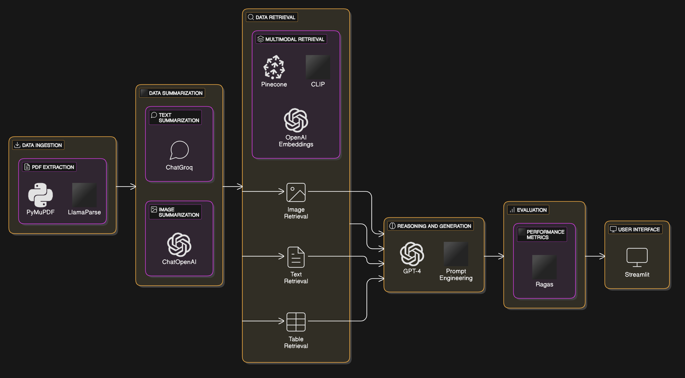

# Chat With Your PDF: Multimodal Data Ingestion

## Overview

This project is a multimodal RAG system that ingests data containing images, text, and tables from the well-known paper “Attention Is All You Need”. The system should be able to retrieve relevant information and reason over the multimodal data to answer user queries.

## Architecture Diagram



## Technical Solution Design

1. Technical Solution Design (expected output: technical design document or PPT)
   - Design an end-to-end architecture for the multimodal data ingestion RAG, using diagrams or flowcharts for clarity.
   - Specify the frameworks and tools you would use and justify your choices with comparisons for each step in the RAG design (data ingestion, data retrieval, and reasoning).

2. Implementation & Practical Application (expected output: demo, code & evaluation)
   - Read and extract text, images, and tables from the paper attached.
   - Ensure the extracted data is structured in a way that preserves the relationships between text, images, and tables (e.g., captions for images, references to tables in the text).
   - Develop a RAG system (data ingestion, data retrieval, and reasoning).
   - Implement a retrieval mechanism that can answer the below queries:
     - How is the scaled dot product attention calculated?
     - What is the BLEU score of the model in English to German translation EN-DE?
     - How long were the base and big models trained?
     - Which optimizer was used when training the models?
     - Show me a picture that shows the difference between Scaled Dot-Product Attention and Multi-Head Attention.
   - For every different experimentation, evaluate your model's output for the 5 questions above. (Mention the evaluation criteria used)

3. Model Enhancements (expected output: document or PPT)
   - Mention the challenges in the current system and how Agentic RAG can solve it.

## Libraries Used

The project utilizes several libraries to facilitate multimodal data processing and retrieval:

- **Python**: The core programming language used for developing the system.
- **tiktoken**: Used for tokenizing text data, essential for processing and analyzing text.
- **pillow**: A library for image processing, used to handle image data extracted from PDFs.
- **lxml**: Utilized for parsing XML and HTML documents, aiding in data extraction.
- **chromadb**: A database for storing and retrieving vector embeddings, crucial for efficient data retrieval.
- **langchain**: Provides tools for building language models and chains, facilitating natural language processing tasks.
- **langchain-community**: Community-driven extensions and tools for LangChain.
- **langchain-openai**: Integrates OpenAI models with LangChain for advanced language processing.
- **langchain-groq**: Offers Groq-based optimizations for LangChain models.
- **python-dotenv**: Loads environment variables from a `.env` file, simplifying configuration management.
- **python-magic-bin**: Used for file type identification, aiding in data processing.
- **langchain-unstructured**: Handles unstructured data within LangChain workflows.
- **unstructured**: Provides tools for processing unstructured data, with PDF support.
- **pdf2image**: Converts PDF files into images, enabling image extraction from documents.
- **pytesseract**: An OCR tool for extracting text from images, useful for processing scanned documents.
- **pypdf**: A library for reading and manipulating PDF files.
- **pymupdf**: Another library for PDF processing, used for extracting images and text.
- **pandas**: A data manipulation library, used for handling tabular data.
- **langchain-chroma**: Integrates Chroma with LangChain for enhanced color processing.
- **langchain-pinecone**: Connects Pinecone vector databases with LangChain for efficient data retrieval.
- **pinecone**: A vector database for storing and querying embeddings.
- **tabula-py**: Extracts tables from PDFs into DataFrames, facilitating data analysis.
- **jpype1**: A bridge between Python and Java, used by Tabula for PDF processing.
- **llama-parse**: A library for parsing and extracting data from documents.
- **llama-index**: Provides indexing capabilities for LlamaParse outputs.
- **transformers**: A library for state-of-the-art natural language processing models.
- **torch**: A machine learning library, used for building and training models.
- **pydantic**: Provides data validation and settings management using Python type annotations.
- **pydantic-settings**: Extends Pydantic for managing application settings.
- **ragas**: A library for RAG (Retrieval-Augmented Generation) systems.
- **nltk**: A natural language processing library, used for text analysis and processing.
- **rouge-score**: A library for evaluating text summarization and translation quality.

## System Structure

The multimodal RAG system is structured as follows:

- **Data Ingestion**: Extracts text, images, and tables from the PDF document. This is handled by the `src/data_extraction_llama_parse.py` script.
- **Data Summarization**: Summarizes the extracted data to create a concise representation, implemented in `src/data_summarize.py`.
- **Retrieval Mechanism**: Uses vector stores to retrieve relevant information based on user queries, as seen in `src/retrieval.py`.
- **Main Application**: The main script `src/main.py` initializes the RAG system and handles user interactions.

## Installation

To set up the project locally, follow these steps:

1. Clone the repository:
   ```bash
   git clone https://github.com/yourusername/chat-with-your-pdf.git
   cd chat-with-your-pdf
   ```

2. Install the dependencies using Poetry:
   ```bash
   poetry install
   ```

3. Set up environment variables by creating a `.env` file in the root directory and adding necessary configurations.

## Usage

To run the system, execute the main script:

```bash
poetry run python src/main.py
```

Follow the on-screen instructions to interact with the system.

## Contributing

Contributions are welcome! Please follow these steps to contribute:

1. Fork the repository.
2. Create a new branch (`git checkout -b feature/YourFeature`).
3. Commit your changes (`git commit -m 'Add some feature'`).
4. Push to the branch (`git push origin feature/YourFeature`).
5. Open a pull request.

## License

This project is licensed under the MIT License - see the [LICENSE](LICENSE) file for details.

## Contact

For any questions or feedback, please contact Omar Elsherif at omarelsherif010@gmail.com.
